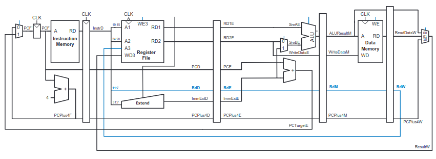
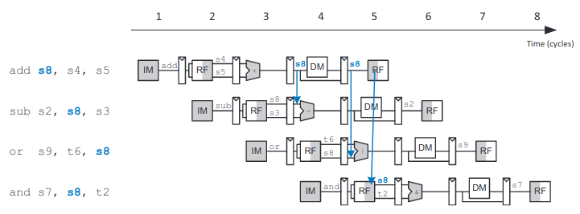
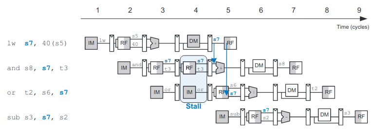
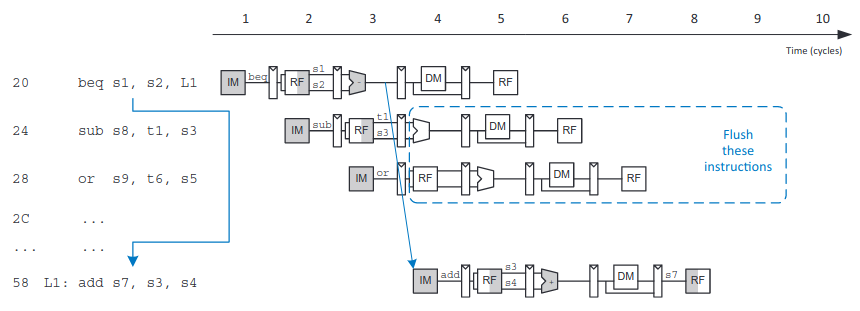
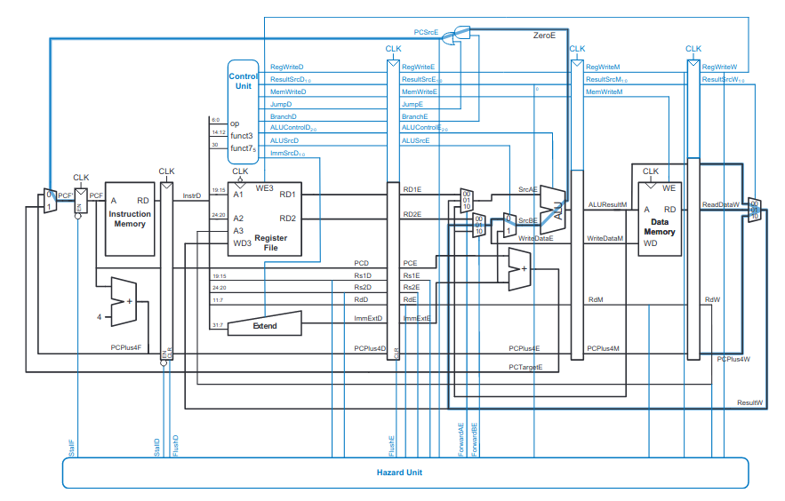
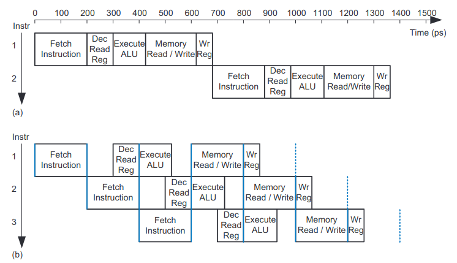

# Pipelined RISC-V CPU
This is a pipelined RISC-V CPU written in SystemVerilog; it implements most of the RV32I ISA (that is, the RV32I base integer instruction set with no extensions). This implementation has a five-stage pipeline with a hazard unit that can forward data, stall the pipeline, and flush the pipeline in the case of a branch misprediction.

## Basic Usage
There are a variety of tests of varying complexity; you need Icarus Verilog installed to run them and (optionally) GTKWave to view the simulated results. Try running
```bash
 $ make test_rv32i_{} # where {} is one of ir_types, b_types, ls_types, functions, peripherals
 $ make waves_rv32i_system # to view results
```

If you want to run this on an Artix 7 and you have Vivado installed then you can run
```bash
 $ make main.bit # make the bitstream (the program_fpga_* tasks depend on this so you can just run those if you want)
 $ make program_fpga_vivado # or program_fpga_digilient if you have djtgcfg
```

## Instruction support
This supports all RV32I instructions except for the half/byte loads and stores and the U-types (`lui` and `auipc`).

## Pipeline Architecture
This implementation divides a simple single-cycle von Neumann\* architecture RV32I CPU into five pipeline stages:
 1. Fetch - read the instruction memory and increment the program counter (unless we have an instruction that jumps in the pipeline, in which case we assume we take the branch and set the program counter appropriately)
 2. Decode - break the instruction we read in the last cycle into its components (based on the operand and possibly the `funct3` and `func7` fields), compute the control unit flags, extend the immediate, and on the negative edge of the clock read out the register based on the instruction we decoded on the positive clock edge
 3. Execute - feed the data we read from the register file OR forwarded data (from a previous instruction that's later along in the pipeline, in the case of a data hazard---see the Hazard Unit section for more) into the ALU, where the ALU control signal was computed in the decode stage
 4. Memory - read or write memory, depending on the instruction we decoded in the decode stage, using either the data we computed from the ALU, or the data we read from the register file
 5. Writeback - write the result of our ALU computation or memory read into the register file or into the program counter (in the case of an instruction that jumps)

In practice, we store the state from each stage and pass it to the next stage on the rising edge of clock. To accomplish this we basically make a big shift register:


\*: The diagrams show separate data and instruction memory, which is accurate in the sense that addresses are calculated separately internally, but the MMU is set up to allow access to the instruction memory through data pointers as long as the instruction pointer is not valid. To make this work in practice the CPU asks the MMU if the instruction in the memory stage of the pipeline is trying to read from instruction memory, and if it is then we stall the fetch stage for a cycle. We could use dual-ported instruction memory instead, but that requires more area.


## Hazard Unit
We encounter hazards when an instruction depends on the result of a previous instruction that is still in the pipeline (i.e. not yet completed). Within this framework there are two types of hazards: data hazards, and control hazards. Data hazards occur when an instruction reads a register that should be written by an instruction that is still in pipeline (such an instruction will not yet have reached the writeback stage); in this case there are only read-after-write (RAW) data hazards, although in a CPU that reorders instructions there can also be write-after-read hazards. Control hazards occur, in this ISA, when there is a jump, since it takes three cycles to get to the execute stage where we compute the jump address (i.e. the new value for the program counter), but we immediately fetch another instruction after one cycle.

To mitigate data hazards we can take two approaches:
 1. If the value that an instruction in the pipeline relies on has already been computed but not yet written back we can *forward* the result of that computation to the instruction that relies on it. This works when we depend on an ALU computation that happened at least one cycle previously, or a memory read that happened at least two cycles previously. An example forward looks like this:

 2. If the value has not yet been computed then we wait until it has been computed. This is called a pipeline *stall*, since it stalls some stages of the pipeline. We implement this by adding an enable input to the decode register and program counter (if stall is true then the program counter and decode doesn't update). An example stall looks like this:


To mitigate data hazards we could stall the pipeline, but instead we choose to speculatively execute, which means that we will predict which branch will be taken. In this case we always predict that the branch will be taken, which works well for loops (which are a very common branch that happens a lot). Modern, state-of-the-art CPUs have much more sophisticated branch predictors. If we mispredicted the branch then we flush the data in the pipeline; since we find out if our branch was taken after three cycles, we only have to flush two stages of the pipeline (the decode and execute stages). An example branch mispredict and flush looks like this, pictographically:


The hazard unit gets connected to most parts of the CPU, with some inputs from the control unit and datapath:


## Performance Analysis
Ideally this processor would have 1 cycle per instruction (CPI), since we issue (i.e. fetch) an instruction every cycle. However, a flush or stall wastes one to two cycles, so the CPI depends on the program being executed. This means that we get less than a 5x speedup. We also have to add a lot more hardware, including: four wiiiiide registers between pipelines of varying length (128 bits minimum), a hazard unit which includes a few comparators and many muxes, a few new control signals in the control unit, and two forwarding multiplexers. Here's a timing diagram of a single-cycle and pipelined processor:

